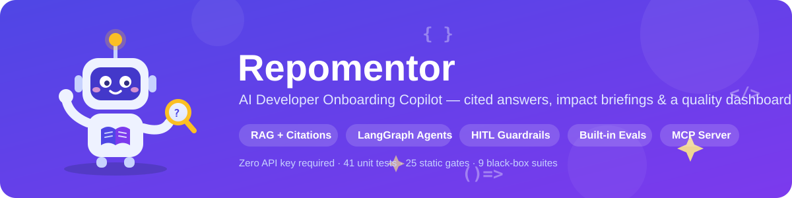
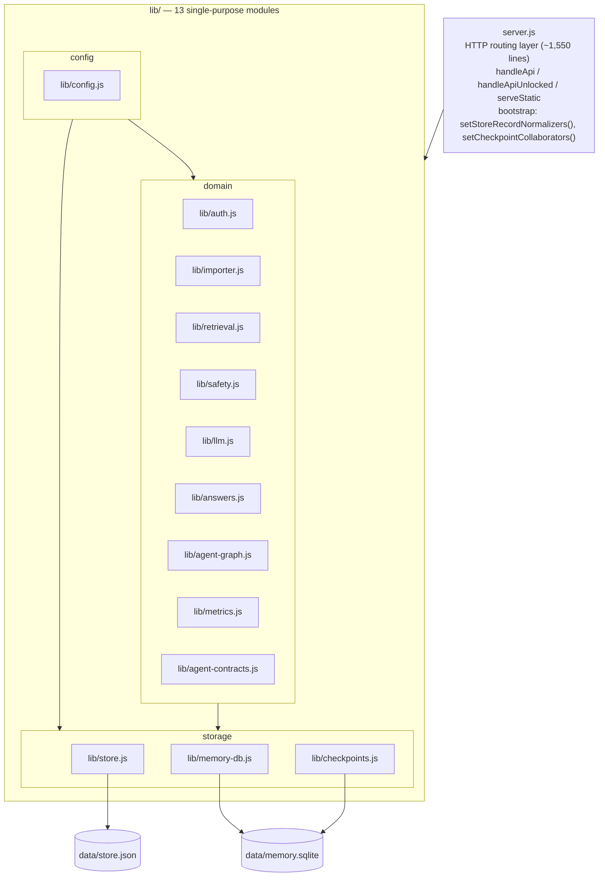
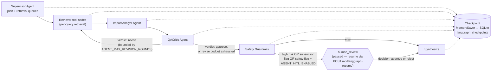

[English](README.md) | [中文](README.zh-CN.md)

<p align="center">
  
</p>

<p align="center">
  <strong>🚀 Live Demo:</strong> https://pm.yuk1no4090.site · <strong>Portfolio:</strong> https://yuk1no4090.site
</p>

# Repomentor

_An MVP web app for helping new engineers, technical PMs, and QA understand a repository with AI-style repository summaries, codebase Q&A, impact analysis, an agentic impact workflow, onboarding plans, citations, feedback, and evaluation metrics._

**A codebase-understanding copilot for new engineers, technical PMs, and QA.** Import a repository and get citation-backed code Q&A, a change-impact briefing written for people who don't read code, and a personalized onboarding plan — backed by an in-product AI quality dashboard you can audit instead of having to trust.

New hires typically take days to weeks to build working context on an unfamiliar codebase, documentation goes stale, and knowledge stays scattered across people's heads. Product managers and QA are usually locked out of impact-analysis tooling entirely, so they can't tell what a change will touch or what to test before it ships.

**Highlights**

- **Three model-agent LangGraph orchestration** — independently prompted Supervisor, ImpactAnalyst, and QACritic calls are coordinated with deterministic retrieval/safety nodes, a bounded QACritic revise cycle (the graph's one real loop, capped by `AGENT_MAX_REVISION_ROUNDS`), native-interrupt human-in-the-loop approval for high-risk changes or whenever the Supervisor itself flags a change for review, resumable MemorySaver checkpoints, and node-level SSE progress streaming. Offline runs degrade each role separately to deterministic logic, and each role's model/temperature is independently configurable.
- **Change-impact briefings for PMs and QA** — one plain-language requirement in, impacted modules / business paths / risk level / testing focus out, in language a non-engineer can act on. Backed by market research on where this gap actually exists (see [docs/POSITIONING.md](docs/POSITIONING.md)).
- **An AI quality dashboard built into the product, not bolted on** — citation coverage, answer-schema compliance, and guardrail hit rates are first-class product UI instead of an external LLMOps tool a PM has to ask an engineer to open.
- **An MCP Server** exposing 4 tools (repository Q&A, impact analysis, onboarding plans, project listing) so AI coding agents such as Claude Code or Cursor can consume this project's analysis directly.

**Quality bar:** 198 `node:test` unit tests, 33 static-check gates, and 9 runtime black-box test suites — all running end-to-end with zero API key required (`npm test`).

More: [docs/POSITIONING.md](docs/POSITIONING.md) (positioning + market validation) · [docs/AGENT_RUNTIME_ARCHITECTURE.md](docs/AGENT_RUNTIME_ARCHITECTURE.md) (implementation boundary) · [docs/PRD.md](docs/PRD.md) (requirements + scope decisions) · [docs/CHANGELOG.md](docs/CHANGELOG.md) (development log)

## Architecture

**Module layering.** `server.js` is a thin ~1,550-line HTTP routing layer; all application logic lives in 13 single-purpose modules under `lib/`, grouped below by config / storage / domain. Dependencies between `lib/` modules are unidirectional and acyclic — see [docs/AGENT_RUNTIME_ARCHITECTURE.md § Code Organization](docs/AGENT_RUNTIME_ARCHITECTURE.md#code-organization) for the full dependency list.



**Agent workflow.** The default `AGENT_GRAPH_MODE=supervisor` graph routes dynamically through more steps than shown here (see [docs/AGENT_RUNTIME_ARCHITECTURE.md § Graph Nodes](docs/AGENT_RUNTIME_ARCHITECTURE.md#graph-nodes)); this is the core path with the bounded QACritic revise cycle, HITL, and checkpoint positions marked:



## Quick Start

```bash
npm install
npm run dev
```

Then open `http://localhost:3000`.

No API key is required for this Quick Start — the app runs fully offline with a deterministic retrieval-based answer generator. To turn on AI-enhanced answers, set three environment variables (full list in [Runtime Configuration](#runtime-configuration)):

```bash
export OPENAI_API_KEY=sk-...
export OPENAI_BASE_URL=https://api.openai.com   # or any OpenAI-compatible provider
export OPENAI_MODEL=gpt-4o-mini
```

## Features


- Repository import from public GitHub URL, ZIP upload, or built-in sample repository.
- Project overview with inferred stack, directory tree, core modules, README summary, and recommended first reads.
- Import-time safety review with prompt-risk and sensitive-content file counts in the project overview.
- Repository Q&A with related files, uncertainty, suggested next questions, feedback buttons, lightweight harness metadata, safety status, guardrail details, and pending memory suggestions.
- Impact analysis with impacted modules, risk level, testing suggestions, and open questions.
- Agent Workflow tab backed by a LangGraph StateGraph that coordinates the Supervisor, ImpactAnalyst, and QACritic model agents (each independently configurable via per-role `OPENAI_MODEL_*`/`OPENAI_TEMPERATURE_*`) with deterministic classification, retrieval, memory, safety, and synthesis; includes a bounded QACritic revise cycle back to retrieval, optional human-in-the-loop approval for high-risk changes or a Supervisor-requested review, MemorySaver checkpointing, and node-level SSE progress streaming via `/api/agent-impact/stream`.
- Onboarding plans run through a lightweight deterministic harness with trace, safety, guardrails, citations, and pending memory suggestions.
- Optional token-bound auth with user, role, scope, local store-backed tokens, and audit metadata. `/api/auth/me` returns the current resolved identity, `/api/auth/users` lists configured and local users, `POST /api/auth/users` creates a local user and returns a one-time visible token, `POST /api/auth/users/disable` disables a local user and its tokens, and `/api/auth/events` lists recent auth decisions without exposing token values. This is not a password-login or session-management system.
- User preference memory suggestions that require explicit confirmation before being saved. Confirmed preferences are scoped by `userId`, defaulting to `local-user` for local/backward-compatible use. API clients can pass `userId` in JSON bodies or the `X-User-Id` header. Confirmed preferences can shape both impact analysis and ordinary Q&A emphasis; confirmed memory is also written to SQLite long-term memory for searchable reuse across later Agent Workflow and Direct Chat runs. Memory suggestions carry user and project ownership so confirmation/ignore actions can verify the active boundary. Ignored suggestions suppress the same key/value suggestion from being repeated for that user. The Copilot inspector includes a lightweight preference and long-term memory manager for viewing, removing one preference value, or clearing all preferences.
- Application-level AI safety checks for prompt injection, system/developer prompt leakage requests, secret requests, read-only tool boundaries, retrieved sensitive content, citation validation, uncited impact areas, sensitive output, and overconfidence.
- A centralized safety policy is exposed as `safety_policy` on `/api/health` and covered by red-team tests.
- Evaluation dashboard with total questions, agent runs, helpful rate, citation coverage, citation status distribution, uncertainty rate, negative feedback, high-risk questions, guardrail hits, memory confirmations, memory status distribution, recent memory events, fallback runs, harness snapshot count, average response time, safety risk and status distribution, import safety risk/status, recent safety events, harness runtime, model mode, tool policy, budget status, schema status, LLM usage, and trace tool distribution, fallback reason distribution, recent harness runs, and recent feedback correlated with harness run ids.

## MCP Server


Besides the web UI, this project ships an [MCP](https://modelcontextprotocol.io) (Model Context Protocol) server (`mcp-server.js`) so AI coding agents such as Claude Code, Cursor, or Claude Desktop can call repository Q&A, impact analysis, and onboarding-plan generation as tools over stdio.

`mcp-server.js` is a thin proxy: it does not read `data/store.json` or import from `lib/` directly (the store uses a single-process write lock plus an in-memory cache, so a second process writing directly could race the main server and lose data). Instead every tool call goes through `fetch` against the already-running HTTP API, reusing the same safety guardrails, harness recording, and auth boundary as the web UI. **The main server must already be running** (`npm start` or `npm run dev`); on startup the MCP server sends one `GET /api/health` probe and exits with a clear, actionable error if the API is unreachable instead of registering tools that could never succeed.

Run it:

```bash
npm start          # terminal 1: the main HTTP API + web UI
npm run mcp        # terminal 2: the MCP stdio server
```

Environment variables:

| Variable | Default | Purpose |
| --- | --- | --- |
| `AI_PM_BASE_URL` | `http://127.0.0.1:3000` | Base URL of the running AI PM HTTP API. |
| `AI_PM_API_TOKEN` | unset | Optional token sent as `Authorization: Bearer <token>`; only needed when the main server runs with `AI_PM_AUTH_REQUIRED=true`. |
| `AI_PM_PROJECT_ID` | unset | Optional default `projectId` so tool calls can omit it once a repository has been imported. |

Example `mcpServers` configuration (Claude Code `.mcp.json`, Cursor `mcp.json`, Claude Desktop `claude_desktop_config.json`, etc.):

```json
{
  "mcpServers": {
    "ai-pm": {
      "command": "node",
      "args": ["/absolute/path/to/mcp-server.js"],
      "env": {
        "AI_PM_BASE_URL": "http://127.0.0.1:3000",
        "AI_PM_PROJECT_ID": "your-imported-project-id"
      }
    }
  }
}
```

Tools exposed:

| MCP Tool | Wraps | When to use |
| --- | --- | --- |
| `list_projects` | `GET /api/projects` | List imported repositories (id, name, source, file/chunk counts, tech stack) to find a `projectId`. |
| `ask_codebase` | `POST /api/chat` | Ask a grounded, citation-backed question about one repository's code or behavior. |
| `analyze_impact` | `POST /api/agent-impact` | Run the full multi-agent LangGraph change-impact workflow: impacted modules, risk level, testing suggestions, execution trace. |
| `get_onboarding_plan` | `POST /api/onboarding` | Generate a role-based, day-by-day onboarding reading plan. |

The current API surface has no standalone repository-search/retrieval endpoint — retrieval only happens inside `/api/chat` and `/api/agent-impact` (`retrieveChunks()` in `lib/retrieval.js` is called from those two route handlers, not exposed on its own route) — so a fifth, retrieval-only tool was intentionally left out rather than reimplemented against `lib/` from a second process, which would break the "thin HTTP proxy" design.

Tool responses are compact, agent-friendly text (not raw JSON) with an explicit file-references list, uncertainty/risk level, and safety status. Tool-level failures (unknown `projectId`, missing required argument, upstream HTTP error) come back as `isError: true` content describing the HTTP status and reason instead of a thrown protocol-level exception, so the calling agent can see and react to the failure.

Covered by `npm run test:mcp` (`scripts/mcp-server-test.js`), which starts a real server, imports the sample repository, drives `mcp-server.js` over stdio through `initialize` -> `tools/list` -> `tools/call`, and verifies the startup error path when the API is unreachable.

## Operations & Reference

The rest of this document covers the full test suite, runtime configuration, Docker deployment, the API surface, and other operational detail.

## Test

```bash
npm run test:static
npm run test:smoke
npm run test:ui
npm run test:safety
npm run test:memory
npm run test:user-memory
npm run test:auth
npm run test:embedding
npm run test:benchmark
npm run test:mcp
npm test
```

`npm run test:static` runs `scripts/static-checks.js`, which performs syntax checks, locale-copy consistency checks, frontend agent UI checks, text-quality checks, runtime dependency checks, API documentation sync checks, store-schema checks, smoke reliability checks, UI acceptance wiring checks, safety guardrail contract checks, safety red-team wiring checks, memory compaction checks, user memory isolation checks, auth boundary checks, embedding provider checks, agent benchmark contract checks, and agent response contract checks without starting a server (this is also where the `node:test` unit suite under `test/` runs, via `scripts/check-unit-tests.js`). `npm test` runs the static checks, smoke test, UI acceptance test, safety red-team test, memory compaction test, user memory isolation test, auth boundary test, embedding provider test, agent benchmark, and the MCP server test.

Static check scripts use the `scripts/check-*.js` naming convention. `scripts/static-checks.js` syntax-checks all `scripts/*.js` files and discovers/runs `check-*.js` automatically.

The smoke test starts the server on temporary ports with isolated temporary data stores, then verifies custom `STORE_PATH` creation, corrupt store backup, invalid timeout/context-budget config fallback, sample import, LangGraph agent execution, memory confirmation/forget, Chinese memory suggestions, safety guardrails, Chinese prompt-injection and secret-request guardrails, tool-permission guardrails, retrieved-context prompt-injection handling, retrieved sensitive content handling, Q&A, evaluation metrics, API-key mode fallback when a fake OpenAI-compatible model returns schema-invalid JSON, context token budget fallback before external model calls, missing-citation guardrails when the fake model cites a nonexistent file, and sensitive-output guardrails when the fake model emits secret-like text. Smoke requests use explicit timeouts and wait for spawned servers to exit during cleanup. Use `npm run test:smoke` to run only the server-backed smoke test.

The UI acceptance test starts the server with an isolated data directory, fetches the served frontend assets, imports the sample workspace, runs the Agent Workflow, confirms a memory suggestion when available, then verifies that Memory, Harness, Safety, long-term memory, dashboard metrics, and the harness audit panel all have renderable API data. Use `npm run test:ui` to run only this served frontend assets and UI data-contract check.

The safety red-team test starts the server with an isolated data directory, verifies the health endpoint exposes the active `safety_policy`, runs prompt-injection, secret-request, tool-escalation, retrieved-instruction, and retrieved-secret cases, and confirms unsafe inputs do not create memory suggestions. Use `npm run test:safety` to run only these red-team cases.

The memory compaction test starts the server with an isolated data directory, confirms conflicting role preferences, verifies the old scalar preference becomes `superseded`, and checks that an active `preference_summary` record with source `memory_compaction` is maintained. Use `npm run test:memory` to run only this long-term memory compaction check.

The user memory isolation test starts the server with an isolated data directory, runs two users through separate memory suggestions using `X-User-Id`, verifies cross-user confirmation returns `MEMORY_USER_MISMATCH`, and checks that preferences plus SQLite long-term memory stay isolated. Use `npm run test:user-memory` to run only this boundary check.

The auth boundary test starts the server with `AI_PM_AUTH_REQUIRED=true`, verifies `/api/health` remains public, rejects missing or invalid tokens, blocks token/user mismatch with `AUTH_USER_MISMATCH`, and confirms memory suggestions are bound to the authenticated user. Use `npm run test:auth` to run only this boundary check.

The embedding provider test starts a fake OpenAI-compatible `/v1/embeddings` server, configures the app with `MEMORY_EMBEDDING_PROVIDER=openai`, confirms memory, and verifies external embedding write and query paths use the configured model. Use `npm run test:embedding` to run only this boundary check.

The agent benchmark starts the server with an isolated data directory, imports the sample repository, and runs a fixed offline benchmark matrix across safe impact analysis, prompt injection, safe Q&A, tool escalation, and multi-turn memory recall. It reports pass rate plus safety, trace, harness, citation, memory suggestion, confirmed long-term memory, and memory reuse checks, then verifies evaluation metrics such as guardrail hits, memory confirmations, persisted harness runs, schema-valid runs, and trace tool counts. Use `npm run test:benchmark` to run only this benchmark.

GitHub Actions runs `npm ci` and `npm test` on pushes to `main` and pull requests.

The project targets Node.js 24 because the long-term memory store uses the built-in `node:sqlite` module. Local Node version managers can read `.nvmrc`; CI uses the same file.

## Runtime Configuration

| Variable | Default | Purpose |
| --- | --- | --- |
| `PORT` | `3000` | HTTP server port. |
| `HOST` | `127.0.0.1` | HTTP server host. |
| `DATA_DIR` | `data` | Directory for runtime JSON storage. |
| `STORE_PATH` | `DATA_DIR/store.json` | Exact runtime store file path. |
| `MEMORY_DB_PATH` | `DATA_DIR/memory.sqlite` | SQLite database path for confirmed long-term memory items. |
| `STORE_MAX_QUESTIONS` / `STORE_MAX_ANSWERS` | `500` | Maximum retained `store.json` question/answer records; older records are trimmed by time order. |
| `STORE_MAX_HARNESS_RUNS` / `STORE_MAX_MEMORY_EVENTS` | `200` | Maximum retained harness run summaries / memory audit events in `store.json`. |
| `CHECKPOINT_MAX_RUNS` | `50` | Maximum number of LangGraph runs whose checkpoint snapshots are retained in SQLite; older runs are pruned. |
| `AI_PM_AUTH_REQUIRED` | unset | Set to `true` to require token authentication for API routes except `/api/health`. |
| `AI_PM_USER_TOKENS` | unset | Token-to-user mapping, either JSON such as `{"token-a":"user-a"}` / `{"token-a":{"userId":"user-a","role":"viewer","scopes":["project:read"]}}` or comma-separated `token:userId` pairs. |
| `MEMORY_EMBEDDING_PROVIDER` | unset | Set to `openai` to use an OpenAI-compatible embeddings endpoint for long-term memory vectors. |
| `OPENAI_EMBEDDING_API_KEY` | `OPENAI_API_KEY` | API key for the embeddings endpoint when external memory embeddings are enabled. |
| `OPENAI_EMBEDDING_BASE_URL` | `OPENAI_BASE_URL` or `https://api.openai.com` | Base URL for the embeddings endpoint; the app calls `/v1/embeddings`. |
| `OPENAI_EMBEDDING_MODEL` | `text-embedding-3-small` | Embedding model name used when external memory embeddings are enabled. |
| `MEMORY_VECTOR_INDEX_PROVIDER` | unset | Set to `http` for a generic HTTP vector index, `qdrant`, or `pinecone`. |
| `MEMORY_VECTOR_INDEX_URL` | unset | Base URL for the external vector index. Generic HTTP calls `/upsert` and `/query`; Qdrant calls `/collections/{collection}/points`; Pinecone calls `/vectors/upsert` and `/query` on the index host. |
| `MEMORY_VECTOR_INDEX_API_KEY` | unset | Optional bearer token for generic HTTP indexes, Qdrant `api-key`, or Pinecone `Api-Key` header value. |
| `MEMORY_VECTOR_INDEX_NAMESPACE` | `ai-pm-memory` / `ai_pm_memory` | Namespace, Qdrant collection name, or Pinecone namespace passed to the external vector index. |
| `OPENAI_API_KEY` | unset | Enables AI-enhanced model calls when set. |
| `OPENAI_BASE_URL` | `https://api.openai.com` | OpenAI-compatible API base URL. |
| `OPENAI_MODEL` | `gpt-4o-mini` | Chat completion model name used when a role has no role-specific override (see below), and by the non-agent `/api/chat` endpoint. |
| `OPENAI_MODEL_SUPERVISOR` | unset (falls back to `OPENAI_MODEL`) | Chat completion model for the Supervisor agent only. |
| `OPENAI_MODEL_IMPACT_ANALYST` | unset (falls back to `OPENAI_MODEL`) | Chat completion model for the ImpactAnalyst agent only. |
| `OPENAI_MODEL_QA_CRITIC` | unset (falls back to `OPENAI_MODEL`) | Chat completion model for the QACritic agent only. |
| `OPENAI_TEMPERATURE` | `0.2` | Sampling temperature used when a role has no role-specific override (see below), and by the non-agent `/api/chat` endpoint. |
| `OPENAI_TEMPERATURE_SUPERVISOR` | unset (falls back to `OPENAI_TEMPERATURE`) | Sampling temperature for the Supervisor agent only. |
| `OPENAI_TEMPERATURE_IMPACT_ANALYST` | unset (falls back to `OPENAI_TEMPERATURE`) | Sampling temperature for the ImpactAnalyst agent only. |
| `OPENAI_TEMPERATURE_QA_CRITIC` | unset (falls back to `OPENAI_TEMPERATURE`) | Sampling temperature for the QACritic agent only. |
| `LLM_CONTEXT_TOKEN_BUDGET` | `8000` | Estimated prompt context token budget before using deterministic fallback. |
| `LLM_REQUEST_TIMEOUT_MS` | runtime default | Per-model-call timeout for both the LangGraph workflow and the direct chat harness. Invalid or non-positive values fall back to a finite default. |
| `AGENT_GRAPH_MODE` | `supervisor` | Graph routing mode: `supervisor` for dynamic multi-agent routing or `linear` for the original 9-node pipeline. |
| `AGENT_MAX_STEPS` | `14` | Maximum LangGraph execution steps (increased from 9 to support supervisor routing overhead). |
| `AGENT_MAX_REVISION_ROUNDS` | `1` | Maximum number of bounded QACritic revise rounds (`qa_plan` verdict `"revise"` loops back to `retrieve`). `0` disables the revise cycle entirely. |
| `AGENT_HITL_ENABLED` | `false` | Set to `true` to enable human-in-the-loop review for high-risk changes, whenever the Supervisor's own plan requests review (`supervisorPlan.require_human_review`), or whenever the input question or retrieved repository content is flagged by the safety scan. In the deterministic/offline fallback (no `OPENAI_API_KEY`), `require_human_review`/`risk_hypothesis`/`riskLevel` are question-keyword or file-path heuristics, not evidence-grounded reasoning about the actual change. |
| `RATE_LIMIT_MAX` | `120` | Maximum API requests per window per IP. Set to `0` to disable rate limiting. |
| `RATE_LIMIT_WINDOW_MS` | `60000` | Rate limit window duration in milliseconds. |
| `LOG_LEVEL` | `info` | Structured log level: `debug`, `info`, `warn`, or `error`. |
| `MAX_QUESTION_LENGTH` | `16000` | Maximum question text length in characters. |
| `CORS_ORIGIN` | `*` | CORS allow-origin header value. Set to a specific origin (e.g. `https://yourapp.com`) in production. |
| `TRUST_PROXY` | `false` | Set to `true` to trust `X-Forwarded-For` header for rate limiting (when behind a reverse proxy). |

### Per-role model selection

The agentic impact-analysis workflow runs three independent model-backed agents (Supervisor, ImpactAnalyst, QACritic — see [Agent Runtime Architecture](#agent-runtime-architecture)) with different jobs: the Supervisor emits a short structured plan, the QACritic makes a bounded approve/revise judgement, and the ImpactAnalyst does the heavy reasoning over repository context. Each can now be pointed at a different model and temperature via the `OPENAI_MODEL_*` / `OPENAI_TEMPERATURE_*` env vars above, instead of all three sharing one global `OPENAI_MODEL`/temperature.

A configuration some teams may want to try: a cheap, fast model for Supervisor and QACritic (short, bounded outputs) and a stronger model for ImpactAnalyst (the one doing the actual repository reasoning), e.g.:

```bash
export OPENAI_MODEL=gpt-4o-mini            # shared default / fallback
export OPENAI_MODEL_IMPACT_ANALYST=gpt-4o  # stronger model for the heavy-reasoning role
# Supervisor and QACritic inherit OPENAI_MODEL (gpt-4o-mini) by not setting an override
```

This makes the model/temperature choice for each role an explicit, independently configurable, and observable setting — every model-backed call in `harness.model_calls[]` reports the model it actually used, and `harness.model_config` in the agent-impact response shows, per role, which model/temperature is in effect and whether it came from a role-specific override or from inheriting the shared default. This repository does not measure the cost or latency of any configuration (every test in this suite runs offline, with no live API calls), so no cost or latency claim is made here — only that the tradeoff is now configurable and observable per role.

## Docker Deployment

```bash
docker build -t ai-pm .
docker run -p 3000:3000 -v $(pwd)/data:/app/data ai-pm
```

Set the following environment variables to enable AI-powered answers:

```bash
# Using DeepSeek (recommended: cheap, OpenAI-compatible, strong Chinese support)
export OPENAI_API_KEY=sk-your-deepseek-key
export OPENAI_BASE_URL=https://api.deepseek.com
export OPENAI_MODEL=deepseek-chat

# Or any other OpenAI-compatible provider:
# export OPENAI_API_KEY=sk-your-openai-key
# export OPENAI_BASE_URL=https://api.openai.com
# export OPENAI_MODEL=gpt-4o-mini
```

Verify the connection:

```bash
curl http://localhost:3000/api/health
```

The response shows whether the LLM is configured, which provider/model is active, the effective LLM request timeout, and the effective context token budget.

Without an API key, the app falls back to a deterministic retrieval-based answer generator. The demo still works, but answers will be template-based rather than AI-generated. The UI shows "AI-enhanced mode" or "Offline retrieval mode" so it is always clear which mode is active.

## Notes

- The runtime uses Node.js plus LangGraph packages for the agent workflow and `@langchain/langgraph-checkpoint` for checkpoint-compatible graph execution.
- GitHub imports use public repository ZIP downloads.
- ZIP uploads are parsed locally by the server.
- Runtime data is stored in `data/store.json` by default. Override with `DATA_DIR` or `STORE_PATH` for isolated runs and tests. Confirmed long-term memory is additionally stored in SQLite at `MEMORY_DB_PATH` using a `memory_items` table plus FTS search when available and `embedding_json` vectors for similarity ranking. By default embeddings are deterministic local `local-hash-v1`; setting `MEMORY_EMBEDDING_PROVIDER=openai` switches memory write/query paths to an OpenAI-compatible `/v1/embeddings` endpoint with local fallback on provider failure. Setting `MEMORY_VECTOR_INDEX_PROVIDER=http` and `MEMORY_VECTOR_INDEX_URL` additionally mirrors long-term memory vectors to an HTTP-compatible vector index and queries it before local SQLite vector ranking; `qdrant` uses Qdrant point upsert/search endpoints with the namespace as collection name; `pinecone` uses Pinecone upsert/query endpoints on the configured index host. Remote failures fall back to SQLite. SQLite schema and data backfills are audited in `schema_migrations`. Non-GET API requests run through a write queue. Store saves write a same-directory temporary file and rename it into place to reduce partial-write corruption. If an existing store contains invalid JSON, it is moved aside with a `.corrupt-` suffix before a fresh normalized store is created.

## Agent Runtime Architecture

The LangGraph workflow is deterministic-first so the product remains demoable without an API key. OpenAI-compatible model calls are used only as an enhancement inside the harness.

```text
input safety
  -> Supervisor agent plan
  -> preference memory
  -> classifier
  -> retriever
  -> context expander
  -> ImpactAnalyst agent
  -> QACritic agent          -- verdict "revise" (bounded by AGENT_MAX_REVISION_ROUNDS) loops back to retriever
  -> safety guardrails
  -> [human_review]          -- only when risk is high, OR the Supervisor's plan requests review, OR the input/retrieved content is safety-flagged, and AGENT_HITL_ENABLED=true; pauses via LangGraph's native interrupt()
  -> structured synthesizer
```

This is the nominal 9-phase walk plus its two optional deviations (the revise loop and the HITL pause) — see the Agent workflow diagram above and [docs/AGENT_RUNTIME_ARCHITECTURE.md § Graph Nodes](docs/AGENT_RUNTIME_ARCHITECTURE.md#graph-nodes) for the full routing rules.

With an API key, Supervisor, ImpactAnalyst, and QACritic have separate prompts, schemas, and model calls through `runAgentModelAdapter()`. `harness.model_calls` exposes each result; the backward-compatible `harness.model_adapter` field summarizes ImpactAnalyst. Without a key, each role falls back independently to deterministic logic.

The impact response exposes the Supervisor decision as `supervisor_plan` and the independent review as `critic_review`, alongside the cited impact areas and merged testing suggestions.

The `modelAdapter` boundary uses an OpenAI-compatible chat completions call when configured and otherwise reports deterministic offline retrieval. LLM transport failures, timeouts, context token budget overruns, HTTP errors, invalid JSON, and schema errors are reported through `harness.model_adapter` before the deterministic fallback is used. The `agentHarness` boundary records runtime metadata for each agent run: run id, model mode, provider, adapter, executed steps, duration, fallback status, fallback reason, schema status, budgets, budget status, read-only tool registry, checkpointing, and errors. The LangGraph workflow runs with `MemorySaver`, keeps runtime `store` out of graph state, persists checkpoint summaries to SQLite `langgraph_checkpoints`, and persists sanitized executable MemorySaver payloads to `langgraph_checkpoint_payloads`; `/api/harness-run` returns checkpoints for the selected run, `/api/langgraph-checkpoint` returns one checkpoint summary for read-only time-travel inspection plus executable-resume availability, and `/api/langgraph-replay` reconstructs the persisted checkpoint timeline as a checkpoint summary replay without invoking the graph, tools, or model. SQLite migration/backfill audit rows are kept in `schema_migrations` and surfaced through `/api/health` plus evaluation metrics. The tool policy is exposed as `mode: "read-only"`, `allow_external_network: false`, `allow_repository_writes: false`, and `allow_shell_execution: false`. `/api/chat` uses a lighter `Direct Chat Harness` with the same model adapter, schema validation, trace shape, deterministic fallback metadata, `memory_used`, pending `memory_suggestions`, input/retrieval/output safety reports, and guardrail details. `/api/onboarding` uses an `Onboarding Harness` for deterministic plan generation with the same trace, safety, guardrail, memory suggestion, and evaluation visibility conventions. Feedback records preserve `harness_run_id` when the answer came from an observable harness run. Repository files are treated as untrusted evidence; retrieved text is never promoted into system instructions. Sensitive-looking values, including API keys, tokens, passwords, credentials, and secrets, are redacted before repository context is sent to a model.

## API Surface

| Method | Path | Purpose |
| --- | --- | --- |
| `GET` | `/api/health` | Server, package version, git commit, Node runtime, environment, uptime, LLM configuration status, and effective request timeout. |
| `GET` | `/api/auth/me` | Return the resolved auth identity, role, scopes, and org id for the current request. |
| `GET` | `/api/auth/users` | Return configured auth users for audit without exposing token values. Requires `auth:read`. |
| `POST` | `/api/auth/users` | Create or update a local store-backed auth user and optionally issue a one-time visible token. Requires `auth:write`. |
| `POST` | `/api/auth/users/disable` | Disable a local store-backed auth user and its tokens. Requires `auth:write`. |
| `GET` | `/api/auth/events` | Return recent auth allow/deny audit events without exposing token values. Requires `auth:read`. |
| `GET` | `/api/projects` | List imported projects without chunk bodies. |
| `POST` | `/api/import` | Import sample, public GitHub repository, or ZIP upload. |
| `POST` | `/api/chat` | Repository Q&A or standard impact analysis with lightweight harness and safety metadata. |
| `POST` | `/api/agent-impact` | LangGraph multi-agent impact workflow. |
| `POST` | `/api/agent-impact/stream` | Same LangGraph multi-agent impact workflow as `/api/agent-impact`, streamed as Server-Sent Events instead of one request/response. |
| `POST` | `/api/onboarding` | Generate role-based onboarding plan. |
| `POST` | `/api/feedback` | Record answer feedback. |
| `GET` | `/api/answers` | Return the most recent persisted Q&A/impact/agent-impact/onboarding answers for one `projectId` (with paired question text and any recorded feedback), for reconstructing conversation history after a page refresh. Supports `limit` (default 50, capped at 200). |
| `GET` | `/api/evaluation` | Return quality, memory, safety, and fallback metrics. |
| `GET` | `/api/harness-run` | Return one persisted harness run audit by `projectId` and `runId`. |
| `GET` | `/api/langgraph-checkpoint` | Return one persisted LangGraph checkpoint summary by `projectId`, `runId`, and `checkpointId` for read-only time-travel inspection. |
| `GET` | `/api/langgraph-replay` | Return a read-only checkpoint summary replay for one LangGraph run by `projectId` and `runId`. |
| `POST` | `/api/langgraph-resume` | Continue a LangGraph run from a persisted checkpoint. Accepts optional `decision` (`"approve"`/`"reject"`) for HITL resume. |
| `GET` | `/api/memory` | Return confirmed preferences, recent memory suggestions, memory audit events, and long-term memories for the resolved user. Supports `X-User-Id` or `userId`, plus `projectId`, `q`/`query`, `status=active|forgotten|superseded|all`, and `limit` for memory inspection. |
| `GET` | `/api/memory/status` | Return SQLite long-term memory database health, counts, migration count, FTS status, and embedding mode without exposing memory content. |
| `GET` | `/api/memory/backups` | List same-directory SQLite memory database backup files without returning memory content. |
| `POST` | `/api/memory/backup` | Create a same-directory SQLite memory database backup and return its basename, size, and SHA-256 checksum. |
| `POST` | `/api/memory/restore-plan` | Validate one backup basename and optional SHA-256, then return a non-executing rollback plan. |
| `POST` | `/api/memory/restore` | Restore the SQLite memory database from a same-directory backup. Requires SHA-256 and `confirm: "RESTORE_MEMORY_DATABASE"`; creates a pre-restore backup first. |
| `POST` | `/api/memory/confirm` | Confirm a pending memory suggestion for the resolved user and update preferences. |
| `POST` | `/api/memory/forget` | Ignore a suggestion, clear one preference, or clear all preferences for the resolved user. |

Error responses keep a human-readable `error` string and add a machine-readable `code`. Memory endpoints currently use:

- `MEMORY_SUGGESTION_NOT_FOUND`
- `MEMORY_SUGGESTION_NOT_PENDING`
- `MEMORY_PROJECT_MISMATCH`
- `MEMORY_USER_MISMATCH`
- `UNKNOWN_MEMORY_PREFERENCE_KEY`
- `UNKNOWN_MEMORY_PREFERENCE_VALUE`
- `MEMORY_BACKUP_REQUIRED`
- `MEMORY_BACKUP_INVALID`
- `MEMORY_BACKUP_NOT_FOUND`
- `MEMORY_BACKUP_CHECKSUM_MISMATCH`
- `MEMORY_RESTORE_CONFIRMATION_REQUIRED`
- `MEMORY_RESTORE_CHECKSUM_REQUIRED`
- `AUTH_REQUIRED`
- `AUTH_INVALID`
- `AUTH_USER_MISMATCH`
- `AUTH_SCOPE_FORBIDDEN`
- `AUTH_USER_ID_REQUIRED`
- `AUTH_USER_NOT_FOUND`
- `AUTH_USER_CONFIG_MANAGED`

Common API errors include:

- `PROJECT_REQUIRED`
- `PROJECT_NOT_FOUND`
- `INVALID_GITHUB_REPO`
- `GITHUB_IMPORT_FAILED`
- `GITHUB_IMPORT_TIMEOUT`
- `IMPORT_SOURCE_REQUIRED`
- `IMPORT_INVALID_ZIP`
- `IMPORT_TOO_LARGE`
- `NO_SUPPORTED_FILES`
- `REQUEST_BODY_TOO_LARGE`
- `QUESTION_REQUIRED`
- `ANSWER_NOT_FOUND`
- `RUN_ID_REQUIRED`
- `HARNESS_RUN_NOT_FOUND`
- `CHECKPOINT_ID_REQUIRED`
- `LANGGRAPH_CHECKPOINT_NOT_FOUND`
- `LANGGRAPH_REPLAY_UNAVAILABLE`
- `LANGGRAPH_REPLAY_UNSUPPORTED`
- `LANGGRAPH_RESUME_UNAVAILABLE`
- `LANGGRAPH_RESUME_USER_MISMATCH`
- `INVALID_FEEDBACK_TYPE`
- `ROUTE_NOT_FOUND`
- `STREAM_FAILED` (`/api/agent-impact/stream` only — an unexpected error after the SSE response has already started; delivered as an `error` SSE event, since the HTTP status is already committed by then)

`/api/agent-impact` remains compatible with the existing frontend and adds these fields:

- `memory_used`: confirmed preference memory applied to the run.
- `memory_suggestions`: pending suggestions that require explicit user confirmation.
- `harness`: LangGraph runtime, run id, model mode, model adapter, executed steps, duration, fallback status, fallback reason, schema status, budgets, budget status, read-only tool registry, model error codes, and errors.
- `safety`: aggregate safety status, risk types, and guardrail checks.

### `/api/agent-impact/stream`: node-level SSE progress

`POST /api/agent-impact/stream` accepts the exact same request body as `POST /api/agent-impact` (`{ projectId, question, userId? }`) and requires the exact same auth (a request that fails validation or auth before the response starts gets a normal JSON error body, same shape and codes as the plain route). Instead of one response after up to 30s of silence, it streams `Content-Type: text/event-stream` frames as the LangGraph workflow progresses through its nodes:

| SSE event | Payload | When |
| --- | --- | --- |
| `workflow_started` | `{ run_id, thread_id, graph_mode, planned_nodes }` | Once, immediately, before the graph starts running. `planned_nodes` is the nominal 9-phase walk (`input_safety` .. `synthesize`); the actual run may diverge (a bounded QACritic revise round re-enters 4 of them, a HITL pause stops short of `synthesize`). |
| `node_completed` | `{ node, agent_role, label, tool, elapsed_ms }` | Once per real graph node as it finishes, in execution order. |
| `revise_round_entered` | `{ round, additional_queries, reason, elapsed_ms }` | Once per bounded QACritic revise round, when `retrieve` re-enters carrying the critic's `additional_queries`. |
| `hitl_paused` | `{ reason, risk_level, change_type, triggers, elapsed_ms }` | Once, if a high-risk change OR a Supervisor-requested review triggers LangGraph's native `interrupt()` inside `human_review`. `triggers` names which signal(s) fired (`["high_risk"]`, `["supervisor_flag"]`, or both). |
| `final` | `{ answerId, kind, payload }` | Once, last — the exact same shape `POST /api/agent-impact`'s JSON response body has. |
| `error` | `{ error, code }` | Only if the run fails after the SSE response has already started (see `STREAM_FAILED` above). |

Authentication uses the same `Authorization: Bearer ...` (or `X-API-Key`/`X-AI-PM-Token`) header as every other route — deliberately **not** the browser `EventSource` API (which cannot set custom request headers) and **not** a token passed as a query-string parameter (tokens in URLs leak into server logs and browser history). Clients consume the stream with `fetch()` and `response.body.getReader()`, parsing `event: <type>\ndata: <json>\n\n` frames by hand; `public/app.js`'s `streamAgentImpact()` is the reference implementation, including graceful fallback to the plain JSON route if the stream endpoint is unavailable, errors mid-flight, or the browser lacks `fetch`/`ReadableStream` support. Closing the client connection mid-stream aborts the underlying LangGraph run (via the same `AbortController` the request-timeout race already uses) and skips writing an answer record for that run.

`GET /api/memory` returns `long_term_memories` plus `long_term_memory_query` so the UI and tests can verify which query, status filter, limit, `embedding_model`, and `vector_search` setting produced the memory list. `GET /api/memory/status` exposes operational database counts and migration health without returning memory content. `POST /api/memory/backup` checkpoints WAL state, writes a same-directory `.sqlite.bak` copy, and returns a SHA-256 checksum so operators can verify backup integrity. `GET /api/memory/backups` lists available backup basenames, and `POST /api/memory/restore-plan` validates a selected backup and returns a manual rollback plan without mutating the active database. `POST /api/memory/restore` requires the backup basename, matching SHA-256, and `confirm: "RESTORE_MEMORY_DATABASE"`; it creates a fresh pre-restore backup, replaces the active SQLite memory database, clears WAL/SHM files, and reopens the database.

Evaluation metrics are scoped to the requested `projectId`, so safety status, output redaction counts, recent redaction events, memory status, memory event action counts, recent memory events, harness runtime, model mode, tool policy, recent tool policy events, budget status, schema status, LLM usage, trace tool usage, fallback, response-time counts, recent safety events, recent harness runs, recent LangGraph checkpoints, recent schema migrations, and recent feedback run correlation reflect the currently selected imported repository. Metrics ignore unknown feedback types so old or manually edited store data cannot pollute quality rates and failure-reason counts.

Memory confirmations, ignored suggestions, selective forgets, and full preference clears are recorded under `memoryEvents` so preference changes remain auditable without writing unconfirmed suggestions into long-lived memory.

`GET /api/harness-run` returns a persisted harness run audit for one `projectId` and `runId`, including the stored run snapshot plus answer trace, harness, safety, guardrail metadata, and persisted LangGraph checkpoint summaries. `GET /api/langgraph-checkpoint` returns one checkpoint summary plus a read-only `time_travel` note and whether executable resume payloads are available. `GET /api/langgraph-replay` returns the ordered checkpoint summary replay for the run. `POST /api/langgraph-resume` reports which of three modes it used as `harness.resume.mode`: `native_interrupt_resume` (the common case — a persisted checkpoint payload exists and a HITL `decision` was supplied, so LangGraph resumes the SAME paused execution via `Command({ resume: decision })` instead of re-running earlier phases), `checkpoint_continuation` (a persisted checkpoint payload exists but no `decision` was supplied, so the paused run is replayed verbatim), or `input_snapshot_reexecution` (no persisted checkpoint payload survives — a legacy fallback that re-executes from the persisted input snapshot with the decision injected directly). Checkpoint audit and replay endpoints remain read-only; see [docs/AGENT_RUNTIME_ARCHITECTURE.md § agentHarness](docs/AGENT_RUNTIME_ARCHITECTURE.md#agentharness) for the full resume-mode table.

Safety payloads include `risk_details`, a normalized explanation list for each risk type so review screens can show why guardrails were triggered. Output guardrails scan the raw generated payload first, then redact credential-like strings before the payload is stored or returned. When redaction occurs, `safety.output_redaction` records whether redaction was applied and how many credential-like matches were replaced, without storing the raw values.

See [docs/AGENT_RUNTIME_ARCHITECTURE.md](docs/AGENT_RUNTIME_ARCHITECTURE.md) for the LangGraph, memory, harness, and safety implementation boundary.

See [docs/OPERATIONS.md](docs/OPERATIONS.md) for deployment, authentication, long-term memory, backup/restore, vector memory, safety, and verification operations.

See [docs/PRD.md](docs/PRD.md) for the product requirements and roadmap.
