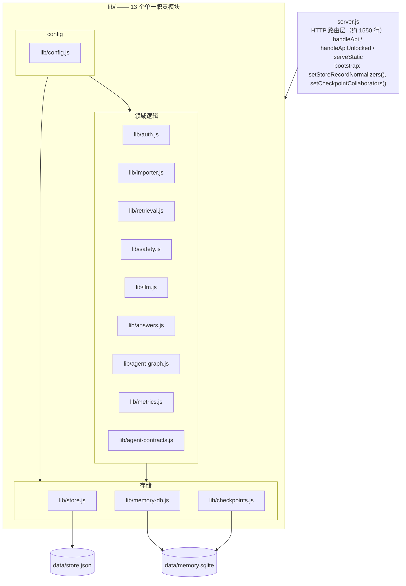
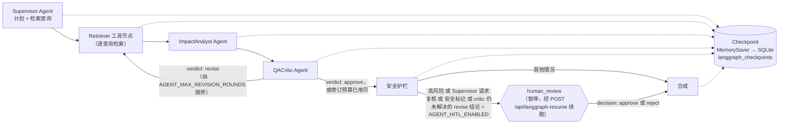

[English](README.md) | [中文](README.zh-CN.md)

<p align="center">
  
</p>

<p align="center">
  <strong>🚀 在线演示：</strong> https://pm.yuk1no4090.site · <strong>作品集：</strong> https://yuk1no4090.site
</p>

# Repomentor

_一个帮助新工程师、技术 PM 和 QA 快速理解代码仓库的 MVP Web 应用：提供 AI 风格的仓库摘要、代码问答、影响分析、agentic 影响分析工作流、onboarding 计划、引用、反馈以及评估指标。_

**面向新入职工程师、技术 PM 和 QA 的代码库理解 Copilot**：导入仓库即获得带引用的代码问答、非工程师可读的改动影响简报、个性化 onboarding 计划——并用产品内置的 AI 质量看板证明自己可信。

新成员建立项目上下文平均需要数天到数周；文档过期、知识散落在个人脑中。PM/QA 通常完全被挡在影响分析工具之外，无法判断"这个需求会动到哪里、该测什么"。

**亮点**

- **LangGraph 三模型 Agent 编排** —— Supervisor、ImpactAnalyst、QACritic 使用独立 prompt、schema 和模型调用，并与确定性检索/安全节点协作；含有界的 QACritic revise 环（图上唯一的真实环路，由 `AGENT_MAX_REVISION_ROUNDS` 限界）、基于 LangGraph 原生 interrupt 的人工审批（HITL，高风险变更或 Supervisor 自身请求复核均可触发）、MemorySaver checkpoint 续跑，以及节点级 SSE 进度流。离线运行时每个角色独立降级为确定性逻辑，且每个角色的模型/温度均可独立配置。
- **面向 PM/QA 的改动影响简报** —— 输入一句自然语言需求描述，输出受影响模块、业务链路、风险级别、测试重点，非工程师可直接读懂。这一差异化切入有调研背书（见 [docs/POSITIONING.md](docs/POSITIONING.md)）。
- **产品内置的 AI 质量看板，而非外挂工具** —— 引用覆盖率、答案 schema 合规率、guardrail 命中率是产品 UI 的一部分，而不是需要工程介入才能打开的外部 LLMOps 工具。
- **MCP Server** 暴露 4 个工具（仓库问答、影响分析、onboarding 计划生成、项目列表），让 Claude Code、Cursor 等 AI coding agent 可以直接消费本项目的分析能力。

**质量证据**：237 条 `node:test` 单元测试、33 项静态检查门禁、9 套运行时黑盒测试套件——全部无需 API key 即可端到端运行（`npm test`）。
<!-- 计数单一来源：本行是全部文档中唯一携带"单元测试数/静态检查数"这两个易变计数的地方。修改前请重新推导：单元测试数 = `node --test "test/**/*.js"` 输出末尾的 "tests N" 行；静态检查数 = `ls scripts/check-*.js | wc -l`（与 `npm run test:static` 打印的 `checkScripts` 字段一致）。其余所有文档一律使用定性表述，不得写死数字，以免过期。 -->

延伸阅读：[docs/POSITIONING.md](docs/POSITIONING.md)（定位与市场验证）· [docs/AGENT_RUNTIME_ARCHITECTURE.md](docs/AGENT_RUNTIME_ARCHITECTURE.md)（实现边界）· [docs/PRD.md](docs/PRD.md)（需求与取舍决策）· [docs/CHANGELOG.md](docs/CHANGELOG.md)（开发日志）

## 架构

**模块分层。** `server.js` 是一个约 1550 行的瘦 HTTP 路由层；全部业务逻辑位于 `lib/` 下 13 个单一职责模块中，下图按 config / 存储 / 领域三组呈现。`lib/` 模块间依赖单向无环——完整依赖清单见 [docs/AGENT_RUNTIME_ARCHITECTURE.md 的 Code Organization 小节](docs/AGENT_RUNTIME_ARCHITECTURE.md#code-organization)。



**Agent 工作流。** 默认的 `AGENT_GRAPH_MODE=supervisor` 图实际路由步骤更多（完整节点见 [docs/AGENT_RUNTIME_ARCHITECTURE.md 的 Graph Nodes 小节](docs/AGENT_RUNTIME_ARCHITECTURE.md#graph-nodes)）；下图是核心路径，标出了有界 QACritic revise 环、HITL 与 checkpoint 的位置：



## 快速开始

```bash
npm install
npm run dev
```

然后打开 `http://localhost:3000`。

本快速开始步骤无需任何 API key——应用完全离线运行，使用确定性的检索式回答生成器。如需开启 AI 增强回答，设置以下三个环境变量（完整清单见[运行时配置](#运行时配置)）：

```bash
export OPENAI_API_KEY=sk-...
export OPENAI_BASE_URL=https://api.openai.com   # 或任意 OpenAI-compatible 提供方
export OPENAI_MODEL=gpt-4o-mini
```

## 功能特性


- 支持从公开 GitHub URL、ZIP 上传或内置示例仓库导入项目。
- 项目概览包含推断出的技术栈、目录树、核心模块、README 摘要，以及推荐的首批阅读文件。
- 导入时的安全审查会在项目概览中给出 prompt 风险和敏感内容文件的计数。
- 仓库问答提供相关文件、不确定性说明、建议的后续问题、反馈按钮、轻量 harness 元数据、安全状态、护栏详情，以及待处理的记忆建议。
- 影响分析提供受影响模块、风险级别、测试建议和待澄清问题。
- Agent Workflow 标签页由 LangGraph StateGraph 驱动，编排 Supervisor、ImpactAnalyst、QACritic 三个模型 Agent（各自可通过 `OPENAI_MODEL_*`/`OPENAI_TEMPERATURE_*` 独立配置），并配合确定性的分类、检索、记忆、安全和综合节点；包含一个回到检索节点的有界 QACritic revise 环、面向高风险变更或 Supervisor 请求复核的可选人工审批（HITL）、MemorySaver checkpoint，以及通过 `/api/agent-impact/stream` 提供的节点级 SSE 进度流。
- Onboarding 计划通过一个轻量的确定性 harness 生成，带有 trace、安全、护栏、引用和待处理记忆建议。
- 可选的、绑定 token 的认证支持用户、角色、scope、本地 store 存储的 token 以及审计元数据。`/api/auth/me` 返回当前解析出的身份，`/api/auth/users` 列出配置和本地用户，`POST /api/auth/users` 创建本地用户并返回一次性可见的 token，`POST /api/auth/users/disable` 禁用一个本地用户及其 token，`/api/auth/events` 列出最近的认证决策而不暴露 token 值。这不是一套密码登录或 session 管理系统。
- 用户偏好记忆建议需要显式确认才会保存。已确认的偏好按 `userId` 隔离，未提供时默认使用 `local-user`，以保持本地/向后兼容的使用方式。API 客户端可以在 JSON body 或 `X-User-Id` 请求头中传入 `userId`。已确认的偏好可以同时影响影响分析和普通问答的侧重点；已确认的记忆也会写入 SQLite 长期记忆，供后续的 Agent Workflow 和 Direct Chat 运行复用检索。记忆建议携带用户和项目归属信息，便于确认/忽略操作校验当前生效的边界。被忽略的建议会抑制该用户下相同 key/value 建议的重复出现。Copilot inspector 内置一个轻量的偏好和长期记忆管理器，可查看、移除单个偏好值，或清空全部偏好。
- 应用级 AI 安全检查覆盖 prompt injection、system/developer prompt 泄露请求、密钥请求、只读工具边界、检索到的敏感内容、引用校验、未引用的影响区域、敏感输出，以及过度自信。
- 集中化的安全策略以 `safety_policy` 的形式暴露在 `/api/health` 上，并有红队测试覆盖。
- 评估 dashboard 展示总问题数、agent 运行次数、有帮助率、引用覆盖率、引用状态分布、不确定率、负面反馈、高风险问题、guardrail 命中数、记忆确认数、记忆状态分布、最近记忆事件、fallback 运行数、harness 快照数、平均响应时间、安全风险与状态分布、导入安全风险/状态、最近安全事件、harness runtime、model mode、工具策略、预算状态、schema 状态、LLM 用量、trace 工具分布、fallback 原因分布、最近 harness run，以及与 harness run id 关联的最近反馈。

## MCP Server


除了 Web UI，本项目还提供了一个 [MCP](https://modelcontextprotocol.io)（Model Context Protocol）server（`mcp-server.js`），让 Claude Code、Cursor、Claude Desktop 等 AI coding agent 可以把仓库问答、影响分析和 onboarding 计划生成作为工具（tools）通过 stdio 调用。

`mcp-server.js` 是一个瘦代理：它不会直接读写 `data/store.json`，也不会直接 import `lib/` 下的模块（store 采用单进程写锁 + 常驻内存缓存的设计，第二个进程直接写入会与主服务竞争并可能丢数据）。每次工具调用都通过 `fetch` 访问已经在运行的 HTTP API，因此会复用与 Web UI 相同的安全护栏、harness 记录和认证边界。**必须先启动主服务**（`npm start` 或 `npm run dev`）；MCP server 启动时会发起一次 `GET /api/health` 探测，如果 API 不可达，会给出清晰、可操作的错误信息并退出，而不是注册一批注定无法成功调用的工具。

启动方式：

```bash
npm start          # 终端一：主 HTTP API + Web UI
npm run mcp        # 终端二：MCP stdio server
```

环境变量：

| 变量 | 默认值 | 用途 |
| --- | --- | --- |
| `AI_PM_BASE_URL` | `http://127.0.0.1:3000` | 正在运行的 AI PM HTTP API 的 base URL。 |
| `AI_PM_API_TOKEN` | 未设置 | 可选 token，会以 `Authorization: Bearer <token>` 的形式透传；仅当主服务以 `AI_PM_AUTH_REQUIRED=true` 运行时才需要。 |
| `AI_PM_PROJECT_ID` | 未设置 | 可选的默认 `projectId`，配置后导入仓库完成即可省略工具调用中的该参数。 |

`mcpServers` 配置示例（Claude Code 的 `.mcp.json`、Cursor 的 `mcp.json`、Claude Desktop 的 `claude_desktop_config.json` 等）：

```json
{
  "mcpServers": {
    "ai-pm": {
      "command": "node",
      "args": ["/absolute/path/to/mcp-server.js"],
      "env": {
        "AI_PM_BASE_URL": "http://127.0.0.1:3000",
        "AI_PM_PROJECT_ID": "your-imported-project-id"
      }
    }
  }
}
```

暴露的工具：

| MCP 工具 | 对应接口 | 使用场景 |
| --- | --- | --- |
| `list_projects` | `GET /api/projects` | 列出已导入的仓库（id、名称、来源、文件/代码块数、技术栈），用于获取 `projectId`。 |
| `ask_codebase` | `POST /api/chat` | 就某个仓库的代码或行为提出问题，返回带引用的、有事实依据的回答。 |
| `analyze_impact` | `POST /api/agent-impact` | 运行完整的多 Agent LangGraph 变更影响分析工作流：受影响模块、风险级别、测试建议、执行 trace。 |
| `get_onboarding_plan` | `POST /api/onboarding` | 生成按角色区分的、按天规划的 onboarding 阅读计划。 |

当前 API 面没有独立的仓库检索/搜索接口——检索只发生在 `/api/chat` 和 `/api/agent-impact` 内部（`lib/retrieval.js` 里的 `retrieveChunks()` 只在这两个路由处理函数内部被调用，没有单独暴露路由）——因此没有额外新增第五个纯检索类工具，以免为此在第二个进程里直接调用 `lib/`，破坏“瘦 HTTP 代理”的设计。

工具的返回内容是紧凑的、面向 agent 的文本（而不是原始 JSON），明确列出文件引用、不确定性/风险级别和安全状态。工具级别的失败（未知 `projectId`、缺少必填参数、上游 HTTP 错误）会以 `isError: true` 的内容返回，说明 HTTP 状态和原因，而不是抛出协议层异常，便于调用方 agent 观察并作出反应。

由 `npm run test:mcp`（`scripts/mcp-server-test.js`）覆盖：该测试会启动一个真实的服务器、导入示例仓库，通过 stdio 依次发送 `initialize` -> `tools/list` -> `tools/call` 驱动真实的 `mcp-server.js`，并验证 API 不可达时的启动报错路径。

## 运维与参考

本文档后续部分是完整的测试套件、运行时配置、Docker 部署、API 一览及其他运维细节。

## 测试

```bash
npm run test:static
npm run test:smoke
npm run test:ui
npm run test:safety
npm run test:memory
npm run test:user-memory
npm run test:auth
npm run test:embedding
npm run test:benchmark
npm run test:mcp
npm test
```

`npm run test:static` 运行 `scripts/static-checks.js`，在不启动服务器的情况下执行语法检查、locale 文案一致性检查、前端 agent UI 检查、文案质量检查、运行时依赖检查、API 文档同步检查、store schema 检查、smoke 可靠性检查、UI 验收接线检查、安全护栏契约检查、安全红队接线检查、记忆压缩检查、用户记忆隔离检查、认证边界检查、embedding provider 检查、agent benchmark 契约检查，以及 agent 响应契约检查（`test/` 下的 `node:test` 单测套件也在这一步通过 `scripts/check-unit-tests.js` 运行）。`npm test` 依次运行静态检查、smoke test、UI 验收测试、安全红队测试、记忆压缩测试、用户记忆隔离测试、认证边界测试、embedding provider 测试、agent benchmark，以及 MCP server 测试。

静态检查脚本采用 `scripts/check-*.js` 命名约定。`scripts/static-checks.js` 会对全部 `scripts/*.js` 文件做语法检查，并自动发现、执行所有 `check-*.js`。

smoke test 会在临时端口和隔离的临时数据存储下启动服务器，验证自定义 `STORE_PATH` 创建、损坏 store 的备份、非法超时/上下文预算配置的回退、示例导入、LangGraph agent 执行、记忆确认/遗忘、中文记忆建议、安全护栏、中文 prompt-injection 与密钥请求护栏、工具越权护栏、检索内容中的 prompt-injection 处理、检索到的敏感内容处理、问答、评估指标、fake OpenAI-compatible 模型返回 schema 非法 JSON 时的 API-key 模式回退、调用外部模型前的上下文 token 预算回退、fake 模型引用不存在文件时的缺失引用护栏，以及 fake 模型输出类密钥文本时的敏感输出护栏。smoke 请求都带显式超时，清理阶段会等待启动的服务器进程退出。使用 `npm run test:smoke` 只运行这个依赖服务器的 smoke test。

UI 验收测试会以隔离数据目录启动服务器，拉取已发布的前端静态资源，导入示例工作区，运行 Agent Workflow，在有可用建议时确认一条记忆建议，然后验证 Memory、Harness、Safety、长期记忆、dashboard 指标和 harness 审计面板是否都能渲染出对应的 API 数据。使用 `npm run test:ui` 只运行这一项前端静态资源与 UI 数据契约检查。

安全红队测试会以隔离数据目录启动服务器，验证健康检查端点暴露了当前生效的 `safety_policy`，运行 prompt-injection、密钥请求、工具越权、检索指令注入、检索密钥泄露等用例，并确认不安全输入不会创建记忆建议。使用 `npm run test:safety` 只运行这些红队用例。

记忆压缩测试会以隔离数据目录启动服务器，制造冲突的角色偏好，验证旧的标量偏好会被标记为 `superseded`，并检查是否维护了一条 source 为 `memory_compaction` 的 active `preference_summary` 记录。使用 `npm run test:memory` 只运行这一项长期记忆压缩检查。

用户记忆隔离测试会以隔离数据目录启动服务器，让两个用户通过 `X-User-Id` 分别产生独立的记忆建议，验证跨用户确认会返回 `MEMORY_USER_MISMATCH`，并检查偏好和 SQLite 长期记忆是否保持隔离。使用 `npm run test:user-memory` 只运行这一项边界检查。

认证边界测试会以 `AI_PM_AUTH_REQUIRED=true` 启动服务器，验证 `/api/health` 仍然公开可访问，拒绝缺失或非法的 token，对 token/用户不匹配返回 `AUTH_USER_MISMATCH`，并确认记忆建议与已认证用户绑定。使用 `npm run test:auth` 只运行这一项边界检查。

embedding provider 测试会启动一个 fake 的 OpenAI-compatible `/v1/embeddings` 服务，以 `MEMORY_EMBEDDING_PROVIDER=openai` 配置应用，确认记忆写入，并验证外部 embedding 的读写路径使用了配置的模型。使用 `npm run test:embedding` 只运行这一项边界检查。

agent benchmark 会以隔离数据目录启动服务器，导入示例仓库，并运行一套固定的离线基准矩阵，覆盖安全影响分析、prompt injection、安全问答、工具越权和多轮记忆召回。它会汇报通过率，以及安全、trace、harness、引用、记忆建议、已确认长期记忆和记忆复用等检查结果，然后验证 guardrail 命中数、记忆确认数、已持久化 harness run 数、schema 合法 run 数和 trace 工具计数等评估指标。使用 `npm run test:benchmark` 只运行这个基准测试。

GitHub Actions 会在 push 到 `main` 和创建 pull request 时运行 `npm ci` 和 `npm test`。

项目要求 Node.js 24，因为长期记忆存储用到了内置的 `node:sqlite` 模块。本地可以用 Node 版本管理器读取 `.nvmrc`；CI 使用同一份文件。

## 运行时配置

| 变量 | 默认值 | 用途 |
| --- | --- | --- |
| `PORT` | `3000` | HTTP 服务器端口。 |
| `HOST` | `127.0.0.1` | HTTP 服务器主机。 |
| `DATA_DIR` | `data` | 运行时 JSON 存储的目录。 |
| `STORE_PATH` | `DATA_DIR/store.json` | 运行时 store 文件的确切路径。 |
| `MEMORY_DB_PATH` | `DATA_DIR/memory.sqlite` | 已确认长期记忆条目的 SQLite 数据库路径。 |
| `STORE_MAX_QUESTIONS` / `STORE_MAX_ANSWERS` | `500` | `store.json` 中保留的最大问题/回答记录数；更早的记录按时间序被裁剪。 |
| `STORE_MAX_HARNESS_RUNS` / `STORE_MAX_MEMORY_EVENTS` | `200` | `store.json` 中保留的最大 harness run 摘要数/记忆审计事件数。 |
| `CHECKPOINT_MAX_RUNS` | `50` | SQLite 中保留其 checkpoint 快照的 LangGraph run 的最大数量；更早的 run 会被裁剪。 |
| `AI_PM_AUTH_REQUIRED` | 未设置 | 设为 `true` 时，除 `/api/health` 外的 API 路由都需要 token 认证。 |
| `AI_PM_USER_TOKENS` | 未设置 | token 到用户的映射，可以是 JSON（如 `{"token-a":"user-a"}` / `{"token-a":{"userId":"user-a","role":"viewer","scopes":["project:read"]}}`），也可以是逗号分隔的 `token:userId` 对。 |
| `MEMORY_EMBEDDING_PROVIDER` | 未设置 | 设为 `openai` 时，长期记忆向量改用 OpenAI-compatible embeddings 接口。 |
| `OPENAI_EMBEDDING_API_KEY` | `OPENAI_API_KEY` | 启用外部记忆 embedding 时，embeddings 接口使用的 API key。 |
| `OPENAI_EMBEDDING_BASE_URL` | `OPENAI_BASE_URL` 或 `https://api.openai.com` | embeddings 接口的 base URL；应用会调用 `/v1/embeddings`。 |
| `OPENAI_EMBEDDING_MODEL` | `text-embedding-3-small` | 启用外部记忆 embedding 时使用的模型名。 |
| `MEMORY_VECTOR_INDEX_PROVIDER` | 未设置 | 设为 `http` 使用通用 HTTP 向量索引，或设为 `qdrant`、`pinecone`。 |
| `MEMORY_VECTOR_INDEX_URL` | 未设置 | 外部向量索引的 base URL。通用 HTTP 调用 `/upsert` 和 `/query`；Qdrant 调用 `/collections/{collection}/points`；Pinecone 在配置的 index host 上调用 `/vectors/upsert` 和 `/query`。 |
| `MEMORY_VECTOR_INDEX_API_KEY` | 未设置 | 通用 HTTP 索引的可选 bearer token，或 Qdrant 的 `api-key`、Pinecone 的 `Api-Key` 请求头值。 |
| `MEMORY_VECTOR_INDEX_NAMESPACE` | `ai-pm-memory` / `ai_pm_memory` | 传给外部向量索引的 namespace、Qdrant collection 名，或 Pinecone namespace。 |
| `OPENAI_API_KEY` | 未设置 | 设置后启用 AI 增强的模型调用。 |
| `OPENAI_BASE_URL` | `https://api.openai.com` | OpenAI-compatible API 的 base URL。 |
| `OPENAI_MODEL` | `gpt-4o-mini` | 当某个角色没有设置角色专属覆盖时（见下）使用的 chat completion 模型名，非 Agent 的 `/api/chat` 接口也使用该值。 |
| `OPENAI_MODEL_SUPERVISOR` | 未设置（回退到 `OPENAI_MODEL`） | 仅用于 Supervisor agent 的 chat completion 模型名。 |
| `OPENAI_MODEL_IMPACT_ANALYST` | 未设置（回退到 `OPENAI_MODEL`） | 仅用于 ImpactAnalyst agent 的 chat completion 模型名。 |
| `OPENAI_MODEL_QA_CRITIC` | 未设置（回退到 `OPENAI_MODEL`） | 仅用于 QACritic agent 的 chat completion 模型名。 |
| `OPENAI_TEMPERATURE` | `0.2` | 当某个角色没有设置角色专属覆盖时（见下）使用的采样温度，非 Agent 的 `/api/chat` 接口也使用该值。 |
| `OPENAI_TEMPERATURE_SUPERVISOR` | 未设置（回退到 `OPENAI_TEMPERATURE`） | 仅用于 Supervisor agent 的采样温度。 |
| `OPENAI_TEMPERATURE_IMPACT_ANALYST` | 未设置（回退到 `OPENAI_TEMPERATURE`） | 仅用于 ImpactAnalyst agent 的采样温度。 |
| `OPENAI_TEMPERATURE_QA_CRITIC` | 未设置（回退到 `OPENAI_TEMPERATURE`） | 仅用于 QACritic agent 的采样温度。 |
| `LLM_CONTEXT_TOKEN_BUDGET` | `8000` | 使用确定性回退之前，估算的 prompt 上下文 token 预算上限。 |
| `LLM_REQUEST_TIMEOUT_MS` | 运行时默认值 | LangGraph 工作流和 direct chat harness 共用的单次模型调用超时时间。非法或非正数值会回退到一个有限的默认值。 |
| `AGENT_GRAPH_MODE` | `supervisor` | 图路由模式：`supervisor` 为动态多 Agent 路由，`linear` 为原始的 9 节点线性管线——linear 模式没有 supervisor 路由、没有 QACritic revise 环，也没有 `human_review` 节点，因此无论 `AGENT_HITL_ENABLED` 是否为 `true`，HITL 在该模式下都是结构性失效的（服务启动时若处于 linear 模式会打印一条告警，点名这一点）。 |
| `AGENT_MAX_STEPS` | `14` | LangGraph 最大执行步数（从 9 上调，以覆盖 supervisor 路由的额外开销）。 |
| `AGENT_MAX_REVISION_ROUNDS` | `1` | 有界 QACritic revise 轮次的最大数量（`qa_plan` 返回 `"revise"` 时会回到 `retrieve`）。设为 `0` 可完全关闭 revise 环。 |
| `AGENT_HITL_ENABLED` | `false` | 设为 `true` 时，对高风险变更、Supervisor 自身请求复核（`supervisorPlan.require_human_review`）、输入问题/检索到的仓库内容被安全扫描标记，或 QACritic 在有界 revise 环预算用尽后仍返回 `"revise"`（`critic_flag`——否则流水线会交付一个 critic 自己仍在拒绝的答案）的情形，启用人工审核（human-in-the-loop）。在确定性/离线回退路径下（未配置 `OPENAI_API_KEY`），`require_human_review`/`risk_hypothesis`/`riskLevel` 都只是基于问题关键词或文件路径的启发式判断，并非对变更本身的证据化推理。 |
| `RATE_LIMIT_MAX` | `120` | 每个 IP 每个时间窗口内的最大 API 请求数。设为 `0` 可禁用限流。 |
| `RATE_LIMIT_WINDOW_MS` | `60000` | 限流时间窗口长度（毫秒）。 |
| `LOG_LEVEL` | `info` | 结构化日志级别：`debug`、`info`、`warn` 或 `error`。 |
| `MAX_QUESTION_LENGTH` | `16000` | 问题文本的最大字符数。 |
| `CORS_ORIGIN` | `*` | CORS 的 allow-origin 响应头值。生产环境建议设为具体来源（如 `https://yourapp.com`）。 |
| `TRUST_PROXY` | `false` | 设为 `true` 时信任 `X-Forwarded-For` 请求头用于限流（部署在反向代理之后时使用）。 |

### 分角色模型选择

Agentic 影响分析工作流运行三个独立的模型驱动 Agent（Supervisor、ImpactAnalyst、QACritic — 见 [Agent Runtime 架构](#agent-runtime-架构)），它们的职责各不相同：Supervisor 输出简短的结构化计划，QACritic 做出有界的 approve/revise 判断，ImpactAnalyst 则对仓库上下文做重度推理。现在可以通过上面的 `OPENAI_MODEL_*` / `OPENAI_TEMPERATURE_*` 环境变量为每个角色单独指定模型和温度，而不是三者共用一个全局 `OPENAI_MODEL`/温度。

一个可以尝试的配置：给 Supervisor 和 QACritic（输出简短、有界）用便宜、快速的模型，给 ImpactAnalyst（真正做仓库推理的角色）用更强的模型，例如：

```bash
export OPENAI_MODEL=gpt-4o-mini            # 共享默认值/回退值
export OPENAI_MODEL_IMPACT_ANALYST=gpt-4o  # 重度推理角色使用更强的模型
# Supervisor 和 QACritic 不设置覆盖，因此继承 OPENAI_MODEL（gpt-4o-mini）
```

这让每个角色的模型/温度选择变成一个显式的、可独立配置且可观测的设置——`harness.model_calls[]` 中的每一次模型调用都会报告它实际使用的模型；agent-impact 响应中的 `harness.model_config` 会按角色展示当前生效的模型/温度，以及它是来自角色专属覆盖还是继承了共享默认值。本仓库不测量任何配置下的成本或延迟（本测试套件的所有测试都在离线状态下运行，没有真实的 API 调用），因此这里不做任何成本或延迟方面的断言——只是说明这一权衡现在可以按角色配置并被观测到。

## Docker 部署

```bash
docker build -t ai-pm .
docker run -p 3000:3000 -v $(pwd)/data:/app/data ai-pm
```

设置以下环境变量以启用 AI 驱动的回答：

```bash
# 使用 DeepSeek（推荐：便宜、兼容 OpenAI 协议、中文能力强）
export OPENAI_API_KEY=sk-your-deepseek-key
export OPENAI_BASE_URL=https://api.deepseek.com
export OPENAI_MODEL=deepseek-chat

# 或使用任意其他 OpenAI-compatible 提供方：
# export OPENAI_API_KEY=sk-your-openai-key
# export OPENAI_BASE_URL=https://api.openai.com
# export OPENAI_MODEL=gpt-4o-mini
```

验证连接：

```bash
curl http://localhost:3000/api/health
```

响应中会显示 LLM 是否已配置、当前生效的 provider/model、有效的 LLM 请求超时时间，以及有效的上下文 token 预算。

未配置 API key 时，应用会回退到基于检索的确定性回答生成器。演示仍然可以正常运行，但回答会是模板化的而非 AI 生成的。UI 会显示 "AI-enhanced mode" 或 "Offline retrieval mode"，让当前所处的模式始终清晰可见。

## 说明

- 运行时使用 Node.js 加 LangGraph 系列包实现 agent 工作流，并用 `@langchain/langgraph-checkpoint` 实现 checkpoint 兼容的图执行。
- GitHub 导入使用公开仓库的 ZIP 下载。
- ZIP 上传由服务器在本地解析。
- 运行时数据默认存储在 `data/store.json`。可以用 `DATA_DIR` 或 `STORE_PATH` 覆盖，便于隔离运行和测试。已确认的长期记忆额外存储在 `MEMORY_DB_PATH` 指定的 SQLite 数据库中，使用 `memory_items` 表，在可用时配合 FTS 全文搜索，并用 `embedding_json` 向量做相似度排序。默认使用确定性的本地 `local-hash-v1` embedding；设置 `MEMORY_EMBEDDING_PROVIDER=openai` 会把记忆的读写路径切换到 OpenAI-compatible 的 `/v1/embeddings` 接口，provider 调用失败时回退到本地实现。设置 `MEMORY_VECTOR_INDEX_PROVIDER=http` 和 `MEMORY_VECTOR_INDEX_URL` 后，长期记忆向量还会额外镜像到一个 HTTP 兼容的外部向量索引，并在本地 SQLite 向量排序之前先查询它；`qdrant` 使用 Qdrant 的 point upsert/search 接口，以 namespace 作为 collection 名；`pinecone` 在配置的 index host 上使用 Pinecone 的 upsert/query 接口。远程调用失败会回退到 SQLite。SQLite schema 和数据回填都记录在 `schema_migrations` 中供审计。非 GET 的 API 请求都会经过写队列。Store 保存时会先写入同目录下的临时文件再原子性地 rename 到目标路径，以降低写入过程中损坏的概率。如果已有 store 文件中是非法 JSON，会先以 `.corrupt-` 后缀移走，再创建一份全新的规范化 store。

## Agent Runtime 架构

LangGraph 工作流采用确定性优先（deterministic-first）的设计，因此即便没有配置 API key，产品依然可以演示。OpenAI-compatible 的模型调用只作为 harness 内部的增强手段。

```text
input safety
  -> Supervisor agent plan
  -> preference memory
  -> classifier
  -> retriever
  -> context expander
  -> ImpactAnalyst agent
  -> QACritic agent          -- verdict 为 "revise" 时（受 AGENT_MAX_REVISION_ROUNDS 限界）回到 retriever
  -> safety guardrails
  -> [human_review]          -- 仅当风险为 high，或 Supervisor 的计划请求复核，或输入/检索内容被安全标记，或 QACritic 在 revise 预算用尽后仍要求修订，且 AGENT_HITL_ENABLED=true 时；通过 LangGraph 原生 interrupt() 暂停
  -> structured synthesizer
```

这是标称的 9 阶段走位，加上它的两个可选分支（revise 环和 HITL 暂停）——完整路由规则见上方的 Agent 工作流图与 [docs/AGENT_RUNTIME_ARCHITECTURE.md 的 Graph Nodes 小节](docs/AGENT_RUNTIME_ARCHITECTURE.md#graph-nodes)。

配置 API key 后，Supervisor、ImpactAnalyst、QACritic 通过 `runAgentModelAdapter()` 使用独立 prompt、schema 和模型调用。`harness.model_calls` 展示每个角色的结果，兼容字段 `harness.model_adapter` 汇总 ImpactAnalyst；没有 key 时每个角色独立回退到确定性逻辑。

影响分析响应通过 `supervisor_plan` 暴露 Supervisor 决策，通过 `critic_review` 暴露独立复核结果，并保留带引用的影响区域与合并后的测试建议。

`modelAdapter` 边界在已配置模型时使用 OpenAI-compatible 的 chat completions 调用，否则报告为确定性的离线检索。LLM 传输失败、超时、上下文 token 预算超限、HTTP 错误、非法 JSON 和 schema 错误都会在使用确定性回退之前通过 `harness.model_adapter` 上报。`agentHarness` 边界为每次 agent 运行记录运行时元数据：run id、model mode、provider、adapter、已执行步数、耗时、fallback 状态、fallback 原因、schema 状态、预算、预算状态、只读工具注册表、checkpoint 情况以及错误。LangGraph 工作流使用 `MemorySaver` 运行，运行时 `store` 不会进入图 state，checkpoint 摘要会持久化到 SQLite 的 `langgraph_checkpoints`，经过脱敏处理的可执行 MemorySaver payload 会持久化到 `langgraph_checkpoint_payloads`；`/api/harness-run` 返回所选 run 的 checkpoint，`/api/langgraph-checkpoint` 返回单个 checkpoint 摘要，用于只读的时间旅行检视，并说明是否支持可执行续跑，`/api/langgraph-replay` 会在不调用图、工具或模型的情况下，把已持久化的 checkpoint 时间线重建为一次 checkpoint 摘要回放。SQLite 的迁移/回填审计记录保存在 `schema_migrations` 中，并通过 `/api/health` 和评估指标对外暴露。工具策略被暴露为 `mode: "read-only"`、`allow_external_network: false`、`allow_repository_writes: false` 和 `allow_shell_execution: false`。`/api/chat` 使用一个更轻量的 `Direct Chat Harness`，复用同一套 model adapter、schema 校验、trace 结构、确定性 fallback 元数据、`memory_used`、待处理的 `memory_suggestions`、输入/检索/输出安全报告和护栏详情。`/api/onboarding` 使用 `Onboarding Harness` 做确定性的计划生成，遵循相同的 trace、安全、护栏、记忆建议和评估可观测性约定。当答案来自可观测的 harness run 时，反馈记录会保留 `harness_run_id`。仓库文件一律被当作不可信证据；检索到的文本永远不会被提升为系统指令。疑似敏感的值（包括 API key、token、密码、凭据和密钥）会在仓库上下文发送给模型之前被脱敏。

## API 一览

| 方法 | 路径 | 用途 |
| --- | --- | --- |
| `GET` | `/api/health` | 服务器、包版本、git commit、Node 运行时、环境、运行时长、LLM 配置状态和有效请求超时。 |
| `GET` | `/api/auth/me` | 返回当前请求解析出的认证身份、角色、scope 和 org id。 |
| `GET` | `/api/auth/users` | 返回已配置的认证用户以供审计，不暴露 token 值。需要 `auth:read`。 |
| `POST` | `/api/auth/users` | 创建或更新一个 store 存储的本地认证用户，可选择签发一次性可见 token。需要 `auth:write`。 |
| `POST` | `/api/auth/users/disable` | 禁用一个 store 存储的本地认证用户及其 token。需要 `auth:write`。 |
| `GET` | `/api/auth/events` | 返回最近的认证放行/拒绝审计事件，不暴露 token 值。需要 `auth:read`。 |
| `GET` | `/api/projects` | 列出已导入的项目，不含代码块内容。 |
| `POST` | `/api/import` | 导入示例、公开 GitHub 仓库或 ZIP 上传。 |
| `POST` | `/api/chat` | 仓库问答或标准影响分析，附带轻量 harness 和安全元数据。 |
| `POST` | `/api/agent-impact` | LangGraph 多 Agent 影响分析工作流。 |
| `POST` | `/api/agent-impact/stream` | 与 `/api/agent-impact` 相同的 LangGraph 多 Agent 影响分析工作流，以 Server-Sent Events 流式返回，而不是单次请求/响应。 |
| `POST` | `/api/onboarding` | 生成按角色区分的 onboarding 计划。 |
| `POST` | `/api/feedback` | 记录回答反馈。 |
| `GET` | `/api/answers` | 按 `projectId` 返回该项目最近持久化的问答/影响分析/agent-impact/onboarding 回答（附带配对的问题文本和已记录的反馈），用于页面刷新后重建对话历史。支持 `limit`（默认 50，上限 200）。 |
| `GET` | `/api/evaluation` | 返回质量、记忆、安全和 fallback 相关指标。 |
| `GET` | `/api/harness-run` | 按 `projectId` 和 `runId` 返回一条已持久化的 harness run 审计记录。 |
| `GET` | `/api/langgraph-checkpoint` | 按 `projectId`、`runId` 和 `checkpointId` 返回一条已持久化的 LangGraph checkpoint 摘要，供只读时间旅行检视使用。 |
| `GET` | `/api/langgraph-replay` | 按 `projectId` 和 `runId` 返回一次 LangGraph run 的只读 checkpoint 摘要回放。 |
| `POST` | `/api/langgraph-resume` | 从一个已持久化的 checkpoint 继续执行 LangGraph run。可传入可选的 `decision`（`"approve"`/`"reject"`）用于 HITL 续跑。 |
| `GET` | `/api/memory` | 返回已解析用户的已确认偏好、最近记忆建议、记忆审计事件和长期记忆。支持 `X-User-Id` 或 `userId`，以及 `projectId`、`q`/`query`、`status=active|forgotten|superseded|all` 和 `limit` 用于记忆检视。 |
| `GET` | `/api/memory/status` | 返回 SQLite 长期记忆数据库的健康状态、计数、迁移次数、FTS 状态和 embedding 模式，不暴露记忆内容。 |
| `GET` | `/api/memory/backups` | 列出同目录下的 SQLite 记忆数据库备份文件，不返回记忆内容。 |
| `POST` | `/api/memory/backup` | 创建一份同目录下的 SQLite 记忆数据库备份，返回其文件名、大小和 SHA-256 校验值。 |
| `POST` | `/api/memory/restore-plan` | 校验一个备份文件名和可选的 SHA-256，返回一份不执行任何操作的回滚计划。 |
| `POST` | `/api/memory/restore` | 从同目录下的备份恢复 SQLite 记忆数据库。需要 SHA-256 和 `confirm: "RESTORE_MEMORY_DATABASE"`；会先创建一次恢复前备份。 |
| `POST` | `/api/memory/confirm` | 为已解析用户确认一条待处理的记忆建议，并更新偏好。 |
| `POST` | `/api/memory/forget` | 忽略一条建议，清除单个偏好，或清空已解析用户的全部偏好。 |

错误响应始终保留一个人类可读的 `error` 字符串，并附加一个机器可读的 `code`。记忆相关接口目前使用以下错误码：

- `MEMORY_SUGGESTION_NOT_FOUND`
- `MEMORY_SUGGESTION_NOT_PENDING`
- `MEMORY_PROJECT_MISMATCH`
- `MEMORY_USER_MISMATCH`
- `UNKNOWN_MEMORY_PREFERENCE_KEY`
- `UNKNOWN_MEMORY_PREFERENCE_VALUE`
- `MEMORY_BACKUP_REQUIRED`
- `MEMORY_BACKUP_INVALID`
- `MEMORY_BACKUP_NOT_FOUND`
- `MEMORY_BACKUP_CHECKSUM_MISMATCH`
- `MEMORY_RESTORE_CONFIRMATION_REQUIRED`
- `MEMORY_RESTORE_CHECKSUM_REQUIRED`
- `AUTH_REQUIRED`
- `AUTH_INVALID`
- `AUTH_USER_MISMATCH`
- `AUTH_SCOPE_FORBIDDEN`
- `AUTH_USER_ID_REQUIRED`
- `AUTH_USER_NOT_FOUND`
- `AUTH_USER_CONFIG_MANAGED`

常见的 API 错误码还包括：

- `PROJECT_REQUIRED`
- `PROJECT_NOT_FOUND`
- `INVALID_GITHUB_REPO`
- `GITHUB_IMPORT_FAILED`
- `GITHUB_IMPORT_TIMEOUT`
- `IMPORT_SOURCE_REQUIRED`
- `IMPORT_INVALID_ZIP`
- `IMPORT_TOO_LARGE`
- `NO_SUPPORTED_FILES`
- `REQUEST_BODY_TOO_LARGE`
- `QUESTION_REQUIRED`
- `ANSWER_NOT_FOUND`
- `RUN_ID_REQUIRED`
- `HARNESS_RUN_NOT_FOUND`
- `CHECKPOINT_ID_REQUIRED`
- `LANGGRAPH_CHECKPOINT_NOT_FOUND`
- `LANGGRAPH_REPLAY_UNAVAILABLE`
- `LANGGRAPH_REPLAY_UNSUPPORTED`
- `LANGGRAPH_RESUME_UNAVAILABLE`
- `LANGGRAPH_RESUME_USER_MISMATCH`
- `INVALID_FEEDBACK_TYPE`
- `ROUTE_NOT_FOUND`
- `STREAM_FAILED`（仅 `/api/agent-impact/stream`——SSE 响应已经开始之后发生意外错误时的兜底错误码；由于此时 HTTP 状态码已经提交，会作为一个 `error` SSE 事件下发，而不是 HTTP 错误状态码。这只是兜底值：`code: error.code || "STREAM_FAILED"` 会优先下发那个错误自身携带的 code——例如提交阶段一次罕见的竞态可能带出 `PROJECT_NOT_FOUND`——只有当该错误本身不带 code 时才会下发 `STREAM_FAILED`）

`/api/agent-impact` 与现有前端保持兼容，并新增以下字段：

- `memory_used`：应用到本次运行的已确认偏好记忆。
- `memory_suggestions`：需要用户显式确认的待处理建议。
- `harness`：LangGraph runtime、run id、model mode、model adapter、已执行步数、耗时、fallback 状态、fallback 原因、schema 状态、预算、预算状态、只读工具注册表、模型错误码和错误信息。
- `safety`：聚合的安全状态、风险类型和护栏检查结果。

### `/api/agent-impact/stream`：节点级 SSE 进度流

`POST /api/agent-impact/stream` 接受与 `POST /api/agent-impact` 完全相同的请求体（`{ projectId, question, userId? }`），认证要求也完全相同（响应开始之前发生的校验/认证失败，返回的是与普通路由相同形状、相同错误码的 JSON 错误）。它不再是等待长达 30 秒后返回一次性响应，而是随着 LangGraph 工作流逐节点推进，流式下发 `Content-Type: text/event-stream` 的事件帧：

| SSE 事件 | 数据 | 触发时机 |
| --- | --- | --- |
| `workflow_started` | `{ run_id, thread_id, graph_mode, planned_nodes }` | 仅一次，在图开始运行之前立即发出。`planned_nodes` 是标称的 9 阶段走位（`input_safety` .. `synthesize`）；实际执行可能有出入（有界 QACritic 修订轮会重新进入其中 4 个节点，HITL 暂停会在到达 `synthesize` 之前停止）。 |
| `node_completed` | `{ node, agent_role, label, tool, elapsed_ms }` | 每个真实图节点完成时发出一次，按执行顺序排列。 |
| `revise_round_entered` | `{ round, additional_queries, reason, elapsed_ms }` | 每个有界 QACritic 修订轮发出一次，即 `retrieve` 携带 critic 的 `additional_queries` 重新进入时。 |
| `hitl_paused` | `{ reason, risk_level, change_type, triggers, elapsed_ms }` | 仅一次，如果任一 HITL 触发信号在 `human_review` 内触发了 LangGraph 原生的 `interrupt()`。`triggers` 标明具体命中了哪个信号：`high_risk`（ImpactAnalyst 风险判断）、`supervisor_flag`（Supervisor 自身计划）、`input_safety_flag`/`retrieved_safety_flag`（对问题/检索到的仓库内容的确定性安全扫描），或 `critic_flag`（有界 revise 环预算用尽后 QACritic 仍返回 `"revise"`）——可以是其中任意组合，顺序固定如上。 |
| `final` | `{ answerId, kind, payload }` | 仅一次，且是最后一个——与 `POST /api/agent-impact` 的 JSON 响应体形状完全相同。 |
| `error` | `{ error, code }` | 仅当 SSE 响应已经开始之后运行失败时发出；`code` 优先是失败错误自身携带的 code，否则为 `STREAM_FAILED`（参见上面的 `STREAM_FAILED`）。 |

鉴权方式与其他所有路由相同，使用 `Authorization: Bearer ...`（或 `X-API-Key`/`X-AI-PM-Token`）请求头——刻意**不**使用浏览器的 `EventSource` API（它无法设置自定义请求头），也**不**把 token 放进 query string（URL 中的 token 会泄漏进服务器日志和浏览器历史记录）。客户端使用 `fetch()` 加 `response.body.getReader()` 消费该流，自行解析 `event: <type>\ndata: <json>\n\n` 格式的事件帧；`public/app.js` 的 `streamAgentImpact()` 是参考实现，包含在流式端点不可用、中途出错、或浏览器不支持 `fetch`/`ReadableStream` 时优雅回退到普通 JSON 路由的逻辑。客户端在流式传输过程中断开连接，会通过请求超时机制本就使用的同一个 `AbortController` 中止底层的 LangGraph 运行，并且不会为该次运行写入答案记录。

`GET /api/memory` 返回 `long_term_memories` 以及 `long_term_memory_query`，便于 UI 和测试验证生成这份记忆列表所用的查询词、状态过滤、limit、`embedding_model` 和 `vector_search` 设置。`GET /api/memory/status` 暴露运营层面的数据库计数和迁移健康状态，不返回记忆内容。`POST /api/memory/backup` 会对 WAL 状态做 checkpoint，写入一份同目录的 `.sqlite.bak` 副本，并返回 SHA-256 校验值，方便运维人员核对备份完整性。`GET /api/memory/backups` 列出可用的备份文件名，`POST /api/memory/restore-plan` 校验所选备份并返回一份不修改当前数据库的手动回滚计划。`POST /api/memory/restore` 需要备份文件名、匹配的 SHA-256 和 `confirm: "RESTORE_MEMORY_DATABASE"`；它会先创建一份全新的恢复前备份，再替换当前的 SQLite 记忆数据库，清理 WAL/SHM 文件，并重新打开数据库。

评估指标按请求的 `projectId` 限定范围，因此安全状态、输出脱敏计数、最近脱敏事件、记忆状态、记忆事件动作计数、最近记忆事件、harness runtime、model mode、工具策略、最近工具策略事件、预算状态、schema 状态、LLM 用量、trace 工具用量、fallback、响应时间计数、最近安全事件、最近 harness run、最近 LangGraph checkpoint、最近 schema 迁移，以及最近反馈与 run 的关联，反映的都是当前选中的已导入仓库。评估指标会忽略未知的反馈类型，避免陈旧或被手动改动过的 store 数据污染质量比率和失败原因统计。

记忆确认、忽略的建议、选择性遗忘和清空全部偏好都会记录在 `memoryEvents` 下，使偏好变更可审计，同时避免把未确认的建议写入长期记忆。

`GET /api/harness-run` 返回某个 `projectId` 和 `runId` 对应的一条已持久化 harness run 审计记录，包含存储的 run 快照，以及答案 trace、harness、安全、护栏元数据和已持久化的 LangGraph checkpoint 摘要。`GET /api/langgraph-checkpoint` 返回一条 checkpoint 摘要，附带一条只读的 `time_travel` 说明，以及是否有可执行的续跑 payload 可用。`GET /api/langgraph-replay` 返回该 run 按顺序排列的 checkpoint 摘要回放。`POST /api/langgraph-resume` 会在 `harness.resume.mode` 中报告实际使用的三种模式之一：`native_interrupt_resume`（常见情况——已持久化的 checkpoint payload 存在且提供了 HITL `decision`，LangGraph 通过 `Command({ resume: decision })` 恢复同一次暂停的执行，而不会重跑更早的阶段）、`checkpoint_continuation`（已持久化的 checkpoint payload 存在但未提供 `decision`，暂停的运行会被原样重放），或 `input_snapshot_reexecution`（没有已持久化的 checkpoint payload 留存——一种回退方案，基于持久化的输入快照重新执行并直接注入 decision）。checkpoint 审计和回放相关接口始终保持只读；完整的 resume 模式表见 [docs/AGENT_RUNTIME_ARCHITECTURE.md 的 agentHarness 小节](docs/AGENT_RUNTIME_ARCHITECTURE.md#agentharness)。

安全 payload 包含 `risk_details`，为每种风险类型提供规范化的说明列表，便于审核界面展示护栏为何被触发。输出护栏会先扫描原始生成的 payload，然后在存储或返回之前脱敏掉类似凭据的字符串。发生脱敏时，`safety.output_redaction` 会记录是否执行了脱敏，以及替换了多少条类似凭据的匹配，而不会存储原始值。

参见 [docs/AGENT_RUNTIME_ARCHITECTURE.md](docs/AGENT_RUNTIME_ARCHITECTURE.md) 了解 LangGraph、记忆、harness 和安全的实现边界。

参见 [docs/OPERATIONS.md](docs/OPERATIONS.md) 了解部署、认证、长期记忆、备份恢复、向量记忆、安全和验证相关的运维操作。

参见 [docs/PRD.md](docs/PRD.md) 了解产品需求和路线图。
